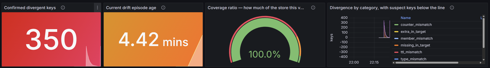

# Driftwatch

**Your cache is lying to you. This is how you find out.**

[](https://github.com/nabrahma/driftwatch/actions/workflows/ci.yaml)
[](https://goreportcard.com/report/github.com/nabrahma/driftwatch)
[](https://pkg.go.dev/github.com/nabrahma/driftwatch)
[](LICENSE)

---

## Something is wrong. Nothing is broken.

A service publishes events. A materializer writes them into Redis. Everything
else reads Redis.

One message goes missing.

Nothing errors. Nothing logs. The publisher published, the subscriber
acknowledged, the store returned OK. Every dashboard stays green.

And one key is quietly wrong. Forever.

You find out weeks later, from a cache hit rate that drifted two points and a
p99 nobody can explain.

---

## Driftwatch watches the same stream, independently

**It builds its own answer.** Same events, folded through a pure function. No
shared memory, no shared connection, no shared code with the thing it checks.

**It compares carefully.** Every disagreement is re-read after a settlement
window. Lag heals. Drift doesn't.

**It tells you which key, and why.** Not a number on a graph. The key, the
category, and the sequence number to search your logs for.

It never writes to your store. Read-only isn't a limitation. It's the reason
anyone will deploy it.

---

## See it

```text
KEY  block:9f3a2c1e
──────────────────────────────────────────────────────────────────────
VERDICT   DIVERGED                                    settled 2.1s ago

ORACLE    set(2)[replica-0 replica-2]        version 2   trust complete
TARGET    absent                             read just now
DIFF      missing in target: replica-0, replica-2

DIAGNOSIS
  [high]   Target is missing this key. driftwatch observed a complete event sequence for publisher
           replica-0 (seq 8801..8847, no gaps), so the materializer most likely dropped or failed
           to apply seq 8847.
           - oracle expects set(2)[replica-0 replica-2] at version 2
           - target holds nothing, read just now
           - 2 events for this key in the retained history
           - the store reports 0 evictions in total, so eviction is unlikely

HISTORY (last 2)
  #0   8801     replica-0   add      replica-0 → {replica-0}            v1    -2.1s
  #1   8847     replica-0   add      replica-2 → {replica-0,replica-2}  v2    -2.1s
```

Read the last line of the diagnosis again.

Driftwatch doesn't just say the key is missing. It says it watched replica-0's
sequence from 8801 to 8847 without a gap, so *its own* view was complete. That is
what makes the store the party that lost something.

And it hands you `seq 8847` to grep for.

---

## Watch it happen

<!-- SCREENSHOT SLOT
     Drop the image at docs/evidence/dashboard-drift-detected.png and delete
     these comment markers. Capture instructions are in docs/OPERATIONS.md.
-->



Row one answers the only question that matters first: can driftwatch see enough
of the keyspace for its verdict to mean anything? Coverage leads, because zero
divergence at 3% coverage is a statement about 3% of your store.

---

## Try it

Six containers. One command. Then break it on purpose.

```sh
git clone https://github.com/nabrahma/driftwatch && cd driftwatch
make demo
make demo-inject-drift
open http://localhost:3000
```

392 keys deleted behind driftwatch's back. 360 confirmed in seven seconds. Back
to zero over the next three minutes as the stream rewrote them, with coverage
never dropping below 0.997.

That's a [real capture](docs/evidence/demo-drift-detected-and-resolved.txt), not
an illustration.

---

## Why you can trust the zero

A naive checker reading a store the instant an event lands reports every
in-flight write as drift. At 10,000 keys and 2,000 events per second, that's an
**8% false-positive rate**. Enough noise to get the tool muted in a week.

Six mechanisms stop it.

A **settlement window** derived from measured propagation lag, not guessed.
**Two-phase confirmation** before anything is reported. **Version fencing**, so a
finding raised against an expectation that has since changed is withdrawn.
**Trust states**, so events driftwatch itself missed become *suspect*, never
drift. **Eviction awareness**, so a full store isn't a broken one. And
**bootstrap honesty**, so it reports partial coverage rather than pretending.

The fourth one is the hard one. When driftwatch loses events, the store looks
wrong and *is right*. Saying so costs coverage and takes discipline.

So it's tested directly. One scenario severs driftwatch's own subscription and
asserts `suspectDivergentKeys > 0` while `divergentKeys == 0`.

[The full argument](docs/CORRECTNESS.md)

---

## Measured

**5.68 seconds** to sweep a million real Redis keys. The bar was ten.

**5,388,510 events. Zero dropped.** Sixty minutes, three publishers, 150,000
keys, a fault injected at the halfway mark and resolved one minute later.

**13 goroutines** at the start. 13 at the end.

**1.03 microseconds** to mark a million keys suspect, because the oracle uses a
generation counter instead of touching them.

AMD Ryzen 7 6800HS. [Raw output](docs/benchmarks/) ·
[Soak capture](docs/evidence/S2-soak-60min-zero-drift.txt)

---

## Deploy it

```yaml
apiVersion: driftwatch.io/v1alpha1
kind: DriftCheck
metadata:
  name: kvcache
  namespace: inference
spec:
  source:
    type: zmq
    zmq:
      endpoints: ["tcp://vllm-0.vllm.inference.svc.cluster.local:5557"]
  projection:
    type: keysetOwnership
    keyTemplate: "block:{{.Key}}"
  target:
    type: redis
    redis:
      addr: redis.inference.svc.cluster.local:6379
      keyPattern: "block:*"
```

Everything else has a default, and the webhook writes them back, so
`kubectl get driftcheck kvcache -o yaml` shows the whole configuration rather
than the fourteen lines you typed.

> Use fully-qualified service names. Endpoints resolve from the manager's
> namespace, and getting it wrong fails as a DNS timeout rather than an error.
> [D-024](docs/DISCOVERIES.md)

---

## What it won't do

**It won't repair anything.** Auto-repair needs domain knowledge it doesn't have.

**It can't check itself.** If its own subscription is lossy it says so. Coverage
drops and findings become suspect. But it cannot tell "the store is wrong" from
"I missed the event that would have made it right." That distinction is the
entire reason the suspect category exists.

**Memory is bounded by key count, not bytes.** Around 656 MiB per million keys
with one event of history, and roughly 16 KiB per key with a full ring. Size
against your ring depth. ([G-001](docs/KNOWN_GAPS.md))

**Redis only.** Sentinel and cluster are routed but untested.

**`make e2e` is not green.** 23 of 27 specs pass. Four have committed but
unverified fixes. Every other test level passes. ([G-003](docs/KNOWN_GAPS.md))

---

## Built on evidence

**806 unit tests. 49 property tests** at 10,000 cases each. **60 fault
scenarios**, run 20 consecutive times without a flake. A **60-minute soak**. A
**ZMQ interop test** against real libzmq, both directions.

`go test ./...` finishes in under three minutes. Everything heavier sits behind a
build tag, because a slow test command stops being run.

**26 findings** are written up in [DISCOVERIES.md](docs/DISCOVERIES.md), each
with a reproduction, an evidence file and a regression test. A sequence number
above 2^53 silently corrupted by any float64 decoder. Discarding timed-out probes
shrinking the settlement window 12x, during an outage, exactly when it needs to
widen. A SUB socket whose publisher is replaced never reconnecting, while
reporting itself healthy.

That file is the most useful thing in this repository.

---

## Learn more

| | |
|---|---|
| [Correctness](docs/CORRECTNESS.md) | Why the comparison is sound, and what stays undetectable |
| [Architecture](docs/ARCHITECTURE.md) | Package boundaries, concurrency, failure policy |
| [Discoveries](docs/DISCOVERIES.md) | 26 things that did not work the way anyone expected |
| [Known gaps](docs/KNOWN_GAPS.md) | The honest list |
| [Metrics](docs/METRICS.md) | All 48, and which 8 to alert on |
| [Operations](docs/OPERATIONS.md) | Runbook |
| [Testing](docs/TESTING.md) | Ten levels, and why e2e is the smallest |
| [Add a source](docs/ADDING_A_SOURCE.md) · [Add a projection](docs/ADDING_A_PROJECTION.md) | Extension guides |
| [Evidence](docs/evidence/README.md) | Every captured artifact, indexed |

---

## Contributing

`make verify` runs everything CI runs. Start with
[ARCHITECTURE.md](docs/ARCHITECTURE.md), then
[CONTRIBUTING.md](CONTRIBUTING.md).

Found something surprising? Add it to
[DISCOVERIES.md](docs/DISCOVERIES.md).

## License

Apache 2.0
